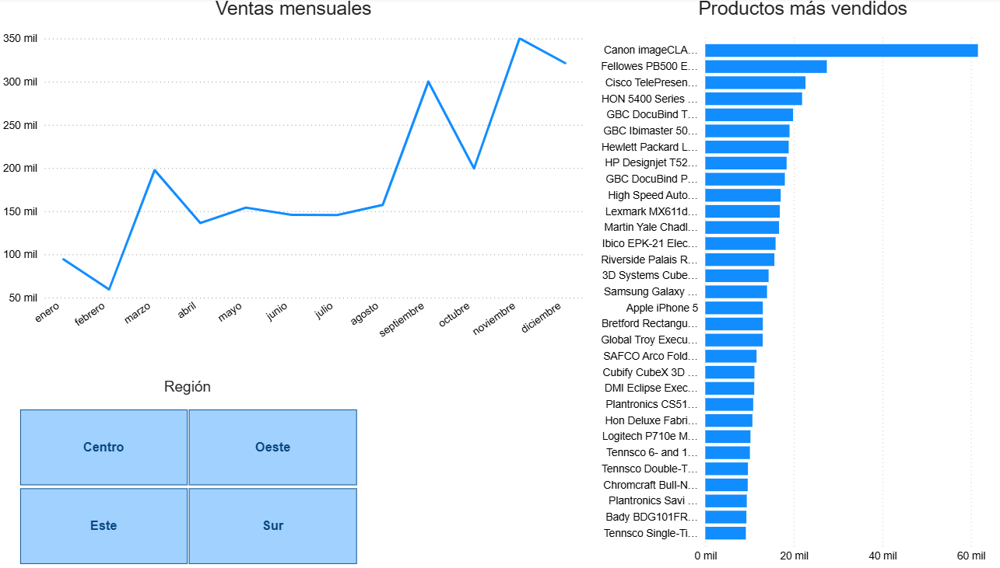
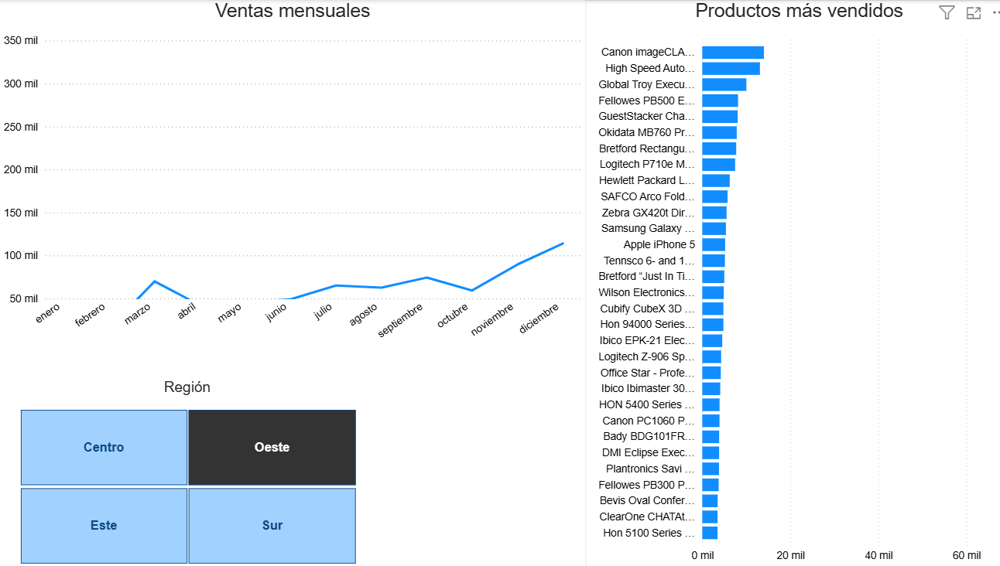

# Portafolio
Portafolio de Análisis de Datos y Business Intelligence. Aquí encontrarás mis proyectos de análisis estadístico, automatización de procesos y visualización de datos (Power BI, DAX, Python, MATLAb, entre otros).
 
> **Nota:** El archivo `graficas.pbix` contiene el proyecto original de Power BI. Para visualizarlo, debes descargarlo y abrirlo con Power BI Desktop.

### Análisis de resultados: Porcentaje de aciertos durante un entrenamiento en una tarea de percepción temporal

Se observa una tendencia de mejora consistente: el promedio de aciertos incrementó del 75% (Día 2) al 77% (Día 4). 
La variabilidad representada por el error estándar (barras rojas) se mantiene estable, lo que sugiere que la mejora fue homogénea en todos los sujetos evaluados.

> **Nota técnica:** Estos datos son resultado de una investigación original realizada durante mi maestría en el Instituto de Neurobiología de la UNAM. Originalmente estaban en formato `.mat`, pero los transformé a `.csv` utilizando Octave para poder procesarlos en Excel y visualizarlos en Power BI.

### ¿Cómo visualizar el proyecto completo?

1. El archivo `graficas.pbix` es el proyecto original de Power BI.
2. Para abrirlo y ver las medidas DAX utilizadas, debes descargarlo y abrirlo con **Power BI Desktop**.

# Dashboard de Análisis de Ventas (SuperStore US)

## Descripción
Dashboard interactivo desarrollado en Power BI para analizar el desempeño de una tienda retail. Incluye un análisis de ventas mensuales y un ranking de productos más vendidos, con la capacidad de filtrar por zona geográfica.

## Vista Previa del Dashboard

## Funcionalidades Destacadas
*Este dashboard permite filtrar por región geográfica con un solo clic para analizar el comportamiento específico de cada zona:*

*En la imagen superior se muestra el filtro aplicado a la región **Oeste**, donde se puede observar que los picos de venta se mantienen en temporada navideña, aunque con un volumen menor al promedio general.*

## Tecnologías Utilizadas
- Power BI Desktop
- Modelado de datos y Lenguaje DAX
- Limpieza y transformación de datos con Power Query
